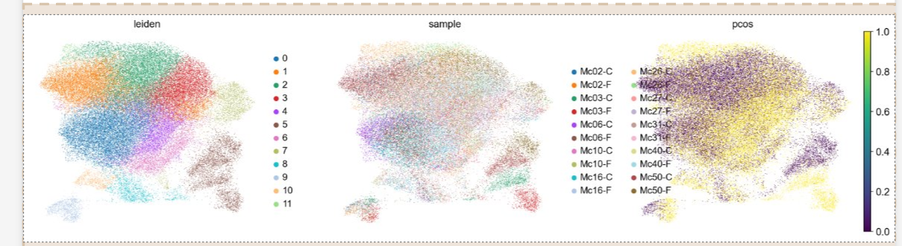
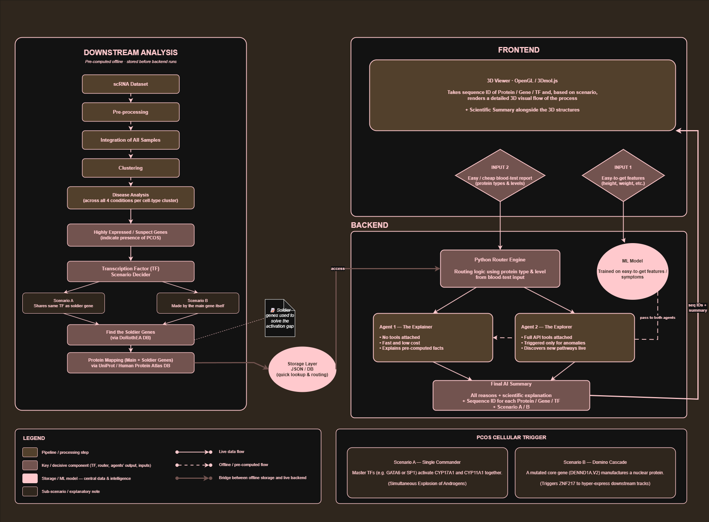

# PCOS Diagnostic Tool — scRNA-seq Powered Blood Test Analysis

> **Diagnosing PCOS from a cheap blood test, backed by single-cell RNA sequencing of ovarian theca cells.**

---
              ## LIVE DEMO LINK: [biohackathon2026.vercel.app](biohackathon2026.vercel.app)

## The Problem

Polycystic Ovary Syndrome (PCOS) affects 8–13% of reproductive-age women globally, yet up to 70% remain undiagnosed. Current diagnosis requires expensive transvaginal ultrasounds, hormonal panels, and sometimes ovarian biopsies — tools that are inaccessible in most primary care and rural clinic settings.

**Our question:** What if we could achieve diagnostic-grade insight from a standard, low-cost blood panel?

## Our Solution

A 3-layer diagnostic system that connects cheap blood test results to deep cellular-level genomics — without requiring the patient to undergo any invasive procedures.

**Layer 1 — Clinical ML Model:** Takes easily accessible patient data (BMI, cycle length, symptoms) and outputs a PCOS risk score.

**Layer 2 — Genomic Cross-Reference Matrix:** Maps elevated proteins from a standard blood panel against a pre-computed knowledge base of 40 suspicious genes and 120 soldier genes — all derived from real single-cell RNA sequencing data.

**Layer 3 — AI Scientific Inference Agent:** Cross-examines the ML score, blood test matches, and transcriptomic pathway data to produce a structured, evidence-based scientific assessment with interactive 3D protein structure visualization.

---

## Single-Cell RNA Sequencing Analysis

This is the scientific backbone of the project. We performed a full downstream analysis of a published scRNA-seq dataset to identify the exact genes and regulatory networks driving PCOS at the cellular level.

### Dataset

Harris, McAllister & Strauss 2023 — *"Single-cell RNA sequencing of human theca cells"*
PMID: 37445796 | Published in: International Journal of Molecular Sciences

- 10 donors (5 PCOS, 5 Healthy)
- 2 conditions per donor (Control / Forskolin-stimulated)
- 20 samples total
- ~55,211 cells × 17,327 genes after QC

In CS terms: a **highly sparse, high-dimensional feature space** containing tens of thousands of genomic features mapped across thousands of individual cellular data points.

### Preprocessing & Quality Control

- Loaded 20 samples via `sc.read_10x_mtx`
- Per-sample QC filtering: removed cells with <200 genes, genes in <3 cells
- Mitochondrial threshold: `pct_counts_mt < 20%` (human `MT-` prefix)
- Ribosomal threshold: `pct_counts_ribo < 40%` (ovarian theca cells are ribosome-heavy, so the standard <2% threshold would eliminate real biology)

### Batch Integration with SCVI — Deep Generative Denoising & Feature Alignment

We implemented a **Variational Autoencoder (VAE) deep generative model** (scVI) to project the high-dimensional sparse matrix into a lower-dimensional latent space. This explicitly models and strips out batch-dependent technical noise, optimizing feature alignment before downstream processing.

Trained with:
- `categorical_covariate_keys=["sample"]`
- `continuous_covariate_keys=["pct_counts_mt", "total_counts", "pct_counts_ribo"]`

Critically, we did **NOT** include `pcos` or `treatment` as covariates — doing so would erase the biological signal we're trying to detect. The VAE learns to separate technical noise from real disease variation.

### Clustering — Vector Embeddings & Graph Community Detection

We generated **low-dimensional vector embeddings** for each data point and constructed a **Shared Nearest Neighbor (SNN) graph**, where individual cells serve as nodes and edges represent local transcriptomic similarity matrix intersections. Leiden community detection at resolution 0.5 produced **12 distinct cell-state clusters**:


*Left: Leiden clusters. Middle: Samples (well-mixed after SCVI integration). Right: PCOS status (signal concentrates in specific clusters).*

| Cluster | Annotation | Key Markers |
|---------|-----------|-------------|
| 0 | Theca — oxidative stress | GLRX, TXNRD1, NQO1 |
| 1 | Theca — vascular/secretory | MGP, PLAT |
| 2 | Theca — transport-active | SLC family |
| 3 | Theca — inflammatory | IL1B, TNFAIP3 |
| 4 | Theca — defense/secretory | SLPI, GKN1 |
| **5** | **Theca — STEROIDOGENIC (HSD17B1+)** | **⭐ PCOS hot zone** |
| 6 | Theca — proliferating (S-phase) | RRM2, CDC20 |
| 7 | Theca — ZNF/germ-like | PIWIL4 |
| 8 | Theca — proliferating (G2/M) | FOXM1, CCNB2 |
| 9 | Theca — myofibroblast-like | S100A4, TGM2 |
| 10 | Theca — hyperactive mito (TSPO+) | Also steroidogenic |
| 11 | Theca — matrix-producing | COL5A1, FN1 |

### Differential Expression — Targeted Vector Space Partitioning

We performed **localized partitioning within each graph community**. By running a localized Bayesian hypothesis test comparing the "PCOS" vs "Healthy" labels strictly within the isolated Cluster 5 sub-graph, we filtered out global background noise and extracted the exact feature weights that significantly shift during the disease state.

Two confidence tiers:

- **Tier 1 (strict):** `lfc_mean > 0.5` AND `proba_m1 > 0.9` → **616 genes**
- **Tier 2 (moderate):** `lfc_mean > 0.5` AND `0.6 < proba_m1 ≤ 0.9` → **1,677 genes**

Key PCOS-associated genes independently recovered:

| Gene | Log Fold Change | Confidence | Known Role |
|------|----------------|------------|------------|
| CYP17A1 | +1.44 | 0.74 | Androgen synthesis (17α-hydroxylase) |
| CYP11A1 | +1.39 | 0.77 | Cholesterol side-chain cleavage |
| SREBF1 | +1.39 | 0.83 | Cholesterol biosynthesis TF |
| STAR | +0.95 | 0.72 | Steroidogenic acute regulatory protein |
| AMH | Top hit | High | Clinical PCOS biomarker |

### Independent Validation

- **GLRX** = top marker of Cluster 0 in our data, independently matching the published "C1-GLRX" cluster from a separate study
- **AMH**, a recognized clinical PCOS biomarker, emerged as a top differentially expressed gene without us specifically looking for it
- **Cholesterol biosynthesis pathway** (INSIG1, MSMO1, DHCR24, HMGCS1, STARD4, SCD, FADS1) activated as a coherent module — consistent with published SREBF1-cholesterol axis dysregulation in PCOS

---

## The Translation Layer — From Genes to Blood Test

### The Problem

We found differentially expressed genes in ovarian cells, but a standard blood test measures **proteins**, not mRNA. How do we bridge this gap?

### Regulatory Networks (DoRothEA) — Deterministic Directed Graphs

We mapped our statistical feature weights onto an **external, deterministic directed graph of biological dependencies** (DoRothEA). Each master transcription factor acts as a **root node** controlling a cascading downstream **dependency tree** of target genes.

This classification produces two scenarios:

**Scenario A — Single Commander:** A shared root node (upstream TF like GATA6 or SREBF2) independently activates both the main disease node and its co-target soldier nodes in a parallel fan-out pattern.

**Scenario B — Domino Cascade:** The suspicious gene's own protein product IS a root node (TF) that directly activates the downstream dependency tree in a serial cascade.

### The Activation Gap — Early State Discrepancy (Silent Stack Activation)

We identified an **early state discrepancy** where a root node (upstream factor) appears idle at the surface layer, but its entire **downstream asynchronous execution stack** (the target "soldier" genes) is already fully saturated and hyperactive.

In biological terms: a gene can be transcriptionally hyperactive inside ovarian cells, but its protein may not appear elevated in a standard blood test due to post-transcriptional regulation.

**Our solution:** For each suspicious gene, we identify its "soldier genes" — downstream co-regulated targets in the same dependency tree. If the soldier genes' proteins ARE elevated in blood, the entire execution stack is confirmed active — even when the root node reads normal at the surface.

This is why the soldier gene list deliberately extends **beyond** the suspicious gene list — to maximize routing coverage and catch silent stack activation scenarios.

### Knowledge Base

The final output of the pre-processing pipeline is a JSON knowledge base containing:
- 40 suspicious genes (top 20 Tier 1 + top 20 Tier 2 + 17 literature-confirmed genes)
- 120 soldier genes (10 per suspicious gene, prioritizing overlap then other activators)
- UniProt protein annotations for all genes
- PDB structure IDs for 3D visualization
- Scenario classification (A/B) per gene
- Regulatory TF assignments

---

## System Architecture


*Full system architecture: pre-computed scRNA pipeline → live backend (ML model + routing engine + AI agents) → interactive frontend with 3D protein rendering.*

```
PRE-COMPUTED (offline, before deployment):
  scRNA dataset → QC → SCVI batch correction → Leiden clustering
  → DE analysis (PCOS vs Healthy) in Cluster 5 → suspicious genes
  → DoRothEA TF lookup → Scenario A/B classification → soldier genes
  → UniProt enrichment → final JSON knowledge base

LIVE BACKEND (per request):
  Input 1: Patient features (BMI, cycle, symptoms)
    → ML model → PCOS probability score

  Input 2: Blood test (list of elevated protein names)
    → Python Router Engine → JSON lookup
    → Routes to Agent 1 (Explainer) when proteins match KB
    → Routes to Agent 2 (Explorer) when proteins don't match [future]

  Agent output: Structured scientific assessment + pathway graph + protein IDs

FRONTEND:
  → 3 AI summary cards (phenotypic, molecular pathway, consensus)
  → Interactive pathway flowchart (TF → main gene → soldiers)
  → 3Dmol.js renders 3D protein structures from PDB/AlphaFold IDs
```

---

## Tech Stack

| Component | Technology |
|-----------|-----------|
| scRNA Pipeline | Scanpy, scVI-tools (Colab GPU) |
| TF Analysis | DoRothEA via decoupler-py |
| Protein Enrichment | UniProt REST API |
| ML Model | scikit-learn (Random Forest) |
| Backend | FastAPI, LangGraph, Python |
| LLM | Groq (Llama 3.3 70B Versatile) |
| Frontend | React, Vite, Tailwind CSS |
| 3D Rendering | 3Dmol.js (PDB + AlphaFold fallback) |

---

## ML Model Performance

**Full clinical features (doctor mode — with lab results):**

| Metric | Score |
|--------|-------|
| Accuracy | 91.3% |
| Precision | 88.7% |
| Sensitivity | 84.8% |

**Patient self-screening (symptoms only — no lab tests):**

| Metric | Score |
|--------|-------|
| Accuracy | 82.4% |
| Precision | 70.1% |
| Sensitivity | 81.4% |

Even with just patient-reported symptoms, the ML model achieves 82% accuracy. The genomic cross-reference layer then adds mechanistic confirmation on top.

---

## Project Structure

```
Biohackathon2026/
├── .env                          # API keys (not committed)
├── .gitignore
├── final_look_up.json            # Pre-computed knowledge base
├── backend/
│   ├── main.py                   # FastAPI app + routing engine
│   ├── schemas.py                # Pydantic request/response schemas
│   ├── agents/
│   │   ├── __init__.py
│   │   └── explainer_agent.py    # Agent 1: Explainer (LangGraph + Groq)
│   └── models/
│       ├── __init__.py
│       ├── run_model.py          # ML model inference
│       ├── doctor_model.joblib   # Trained model (full features)
│       └── patient_model.joblib  # Trained model (symptoms only)
├── frontend/                     # React + Vite + Tailwind
│   ├── src/
│   └── ...
├── pre_process_analysis/
│   ├── scRNA_analysis.ipynb      # Full scRNA-seq pipeline notebook
│   ├── pcos_gene_automation.py   # DoRothEA + UniProt enrichment
│   ├── cluster5_tier1.csv        # DE results (strict)
│   ├── cluster5_tier2.csv        # DE results (moderate)
│   └── scvi_model/               # Trained SCVI model
├── figures/
│   └── umap.png                  # UMAP visualization
└── sc-RNA_dataset/               # Raw scRNA-seq data
```

---

## Running the Project

### Backend

```bash
# From project root
cd backend
pip install fastapi uvicorn groq langgraph python-dotenv pydantic scikit-learn joblib pandas
uvicorn main:app --reload
```

Backend runs at `http://127.0.0.1:8000`. API docs at `http://127.0.0.1:8000/docs`.

### Frontend

```bash
cd frontend
npm install
npm run dev
```

Frontend runs at `http://localhost:5173`.

### Environment Variables

Create `.env` at the project root:
```
GROQ_API_KEY=your_groq_api_key_here
```

---

## Data Sources

- **scRNA-seq dataset:** Harris, McAllister & Strauss 2023 (PMID 37445796) — single-cell RNA sequencing of human ovarian theca cells
- **TF-target database:** DoRothEA, accessed via decoupler-py
- **Protein annotations:** UniProt REST API
- **3D structures:** RCSB PDB + AlphaFold Protein Structure Database
- **ML training data:** PCOS clinical dataset (included in repo)

---

## Future Directions

- **Agent 2 (The Explorer):** Handles unknown proteins via live API research — UniProt, STRING-DB, PubMed — for novel pathway discovery
- **Expanded cell types:** Granulosa cells, endometrial tissue; extend to endometriosis
- **Clinical validation:** Prospective study with real patient blood samples
- **EHR integration:** Plug into electronic health records for automated screening

---
